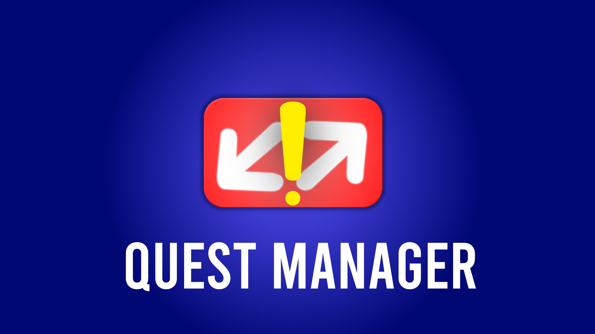

# Quest Manager
QuestManager is a plugin created to make creating and managing quests/missions/objectives easier.

__NOTICE!__
This plugin only supports Godot 4.2+. Please update the engine if youre 
on an older Godot 4 version

## Installation
1. Copy the `quest_manager` directory to your `res://addons/` folder. 
2. Open `Project>Project Settings>Plugins` and enable the `Quest Manager` plugin
3. You now have a new tab `Quest Manager` at the top of the editor.

## Documentations

[Creating Quests](documentation/Creating_Quests.md)

[Quest Manager API](documentation/Quest_Manager_API.md)

[Video Tutorial pt 1: Setup and Interface](https://youtu.be/zBJ6NEJTT9s)

[Video Tutorial pt 2: Adding and Completing Quests](https://youtu.be/JI_LXcY8-Ug)

## Discord

[Join the Chevifier Discord](https://discord.gg/xEBEm5JeCU)

## License

Licensed under the MIT license, see `LICENSE` for more information.

## Other

[Chevifier Youtube Channel](https://www.youtube.com/Chevifier)
