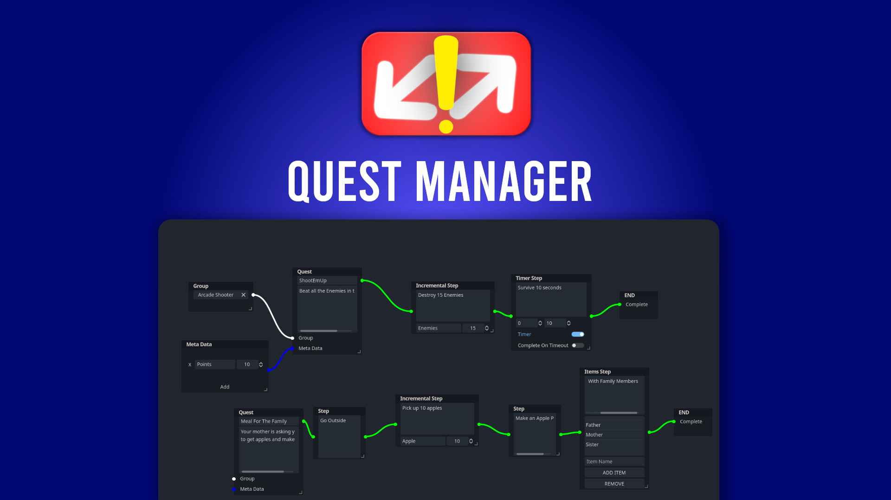

# Quest Manager
QuestManager is a plugin created to make creating and managing quests/missions/objectives easier.

__NOTICE!__ This plugin was created specifically for Godot 4.X

## Installation
1. Copy the `addons/quest_manager` directory to you projects root folder.
2. Open `Project>Project Settings>Plugins` and enable the `Quest Manager` plugin

## Documentations

[Creating Quests](documentation/Creating_Quests.md)

[Using Quest in game](documentation/Using_Quests_InGame.md)

[Quest Manager API](documentation/Quest_Manager_API.md)

[Video Tutorial](https://www.youtube.com/Chevifier)

## Discord

[Join the Chevifier Discord](https://discord.gg/xEBEm5JeCU)

## License

Licensed under the MIT license, see `LICENSE` for more information.

## Other

[Chevifier Youtube Channel](https://www.youtube.com/Chevifier)