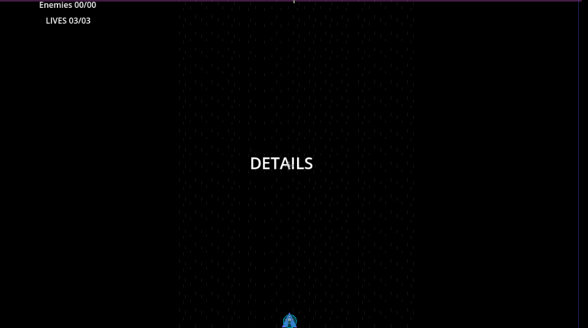
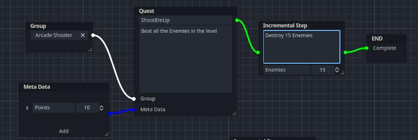

# Creating Quests

## The Editor

To create a quest you should use the editor. The editor has various nodes required to create quests. These nodes are:
1. `Quest Node` - This Node is the main quest node it requires the `quest_name` and `quest_details`
2. `Step Node` - This node is an `action_step` node and only requires a discription of the action to complete.
3. `Incremental Step Node` - This node is an `incremental_step` node and requires both its `details` , `item_name` and the `required` amount to complete. 
4. `Item Step Node` - This node is an `items_step` node and requires the `details` as well as the list of items/actions to complete
5. `Group Node` - A group node only requires its `group` name and can be connected to multiple quest nodes.
6. `Meta Data Node` - A meta data node is use to add meta data to quest such as quest rewards or any arbitrary information stored as a `String`, `Integer`, `float` or `boolean`
7. `Timer Node` - This Node is a `timer_step` node that is used as a Timer or a Stopwatch
8. `Callable Node` - This Node is a `callable_step` node that is used to call a function from an Autoloaded Script.
9. `Branch Node` - The Node is a `branch_step` that works similar to anc `action_step` but has 2 output for creating branching quests.
10. `Rewards Node` -This Node is similar to a meta_data node but can only be connected to a `Quest Node`
11. `End Node` - This node is required to end a quest after the final step.

## How to use

For this example we'll keep it simple and create a 1 step Quest to kill 15 enemies.

1. First add a Quest node, an Incremental Step Node and a End Node.
2. Connect these nodes dragging the green connection pins from one to another: Quest Node > Incremental Node > End Node

    
3. Additionally, you can add a group and Meta Data Node and Fill in the information for each node we wont use the Group and meta data so theyre not required here.
4. Save the quest file choosing a location and giving it a name. Quest files are save with the `.quest` extension.
5. The Space Arcade Scene is included in the Examples Folder. Open it and find the UI node. Drag the quest file into the Quest property in the UI inspector window.
6. Notice the Quest Resource is Read only and has 2 dictionaries.
   - `Quest Data` -Contains all the quests stored in the quest resource
   - `Graph Data` -Contains all the Data for the Editor
7. Open up the UI.gd script. Notice in the _ready() function we do a few things:
    - `QuestManager.add_quest_from_resource(quest,"ShootEmUp")` - Here we tell the Quest Manager to load this resource and add its quest thats named `ShootEmUp` to the player quests
    - We also connect a few signals:
        - `step_updated` - we update the UI to show what changed in the case an enemy was killed so the value increases
        - `step_complete` - We just use a lambda here to print step complete
        - `quest complete` - We update the UI to show that the quest was completed
        - `quest_failed` - Show if the quest failed i.e if the player died
    - Then we set the QuestStart label text to the quest details and do some tweening the start the level
8. Open up the `Example/ExampleOne/Projectile.gd` script. Notice we check to see if the bullet hits an enemy. If it did, we call `$QMStepTracker.update_step()` before removing the projectile.
9. QMStepTracker is a Node you can add to objects in your project to track a quest's step. You set its type and pass in the quest_id and  Step id. In this case this Trancker is an Incremental Step Tracker that increases `collected` items of the `Incremental Step` by 1 by default.
10. In the UI we also check if the player ran out of lives. If so we call `QuestManager.fail_quest("ShootEmUp")` This sets the quest as failed and emits the `quest_failed` signal.
11. And Thats about it for the tutorial. If a quest has multiple steps the `step_updated` and `step_completed` signals returns a new step its up to you how you want to display the information of that current step by checking its `step_type`. Check the [API](Quest_Manager_API.md) for what properties each `step_type` contains.

# Creating Quests from code

As of version 0.3.0, you can now create quest at Run-Time using the ScriptQuest class. This allows you to be able to randomly/procedurally make quests if necessary. To do this check the ScriptQuest class in the [Script Quest API](Script_Quest_API.md)

## Exporting Projects

Running a project in the editor is fine but when you want to export a project youll need to tell godot to export your quest files. To do this, in the export window, select your export format(Window/Linux/Android etc) then open the Resources tab and add `*.quest` as an entry with comma seperating other file types.
